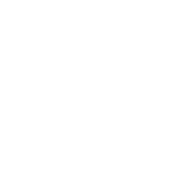

    <h1 align="center">Hi there, I'm Akash Kanaujiya </h1>
    <h3 align="center">Web Developer | Android Developer | Coder </h3>

 
 

<!-- About section -->
<h2>Something about me:</h2>
<ul>
    <li>
        👋
        Hi, I’m 
        <a href="https://github.com/iakashkanaujiya">@iakashkanaujiya</a>
    </li>
    <li>👀I’m interested in Full Stack web development, Machine Learning, Software Development, and leading business.</li>
    <li>
        🌱
        I’m currently learning Software Development and Machine Learning.
    </li>
    <li>
        💞️ 
        I’m looking to collaborate on Web Development and Machine Learning projects
    </li>
    <li>
        📫 
        How to reach me: Conact me at
        <a href="mailto:iakashkanaujiya@gmail.com">iakashkanaujiya@gmail.com</a>
    </li>
</ul>
 
 

<!-- Social Media -->
<h2>Lets Connect🤝</h2>

    
    
    

 
 

<!-- Tools and Tech used -->
<h2>Tools and Techs Used by me 👇</h2>

    <!-- React -->
    
    <!-- Next Js -->
    
    <!-- Redux -->
    
    
    
    
    
    
    
    

 
 

<!-- Lang used status -->
<h2>⚡ Top languages:</h2>

